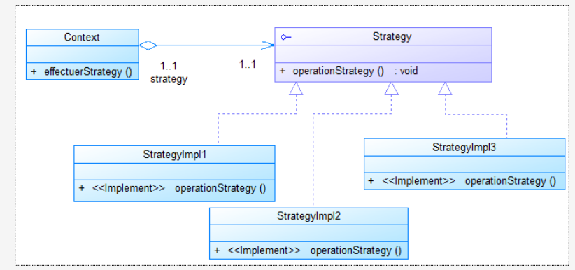
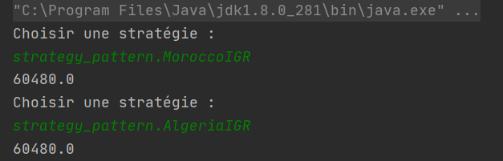
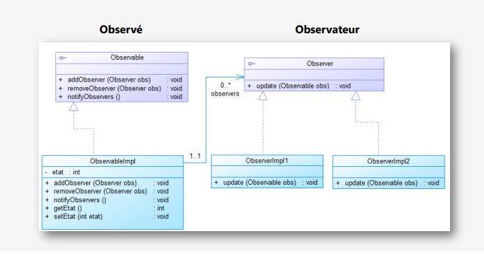
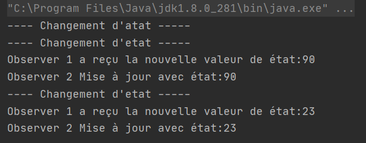
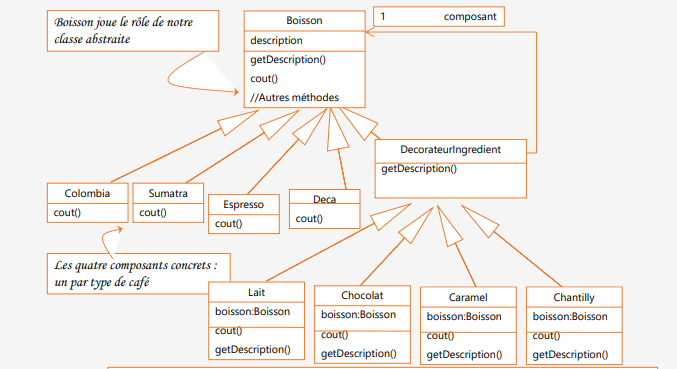
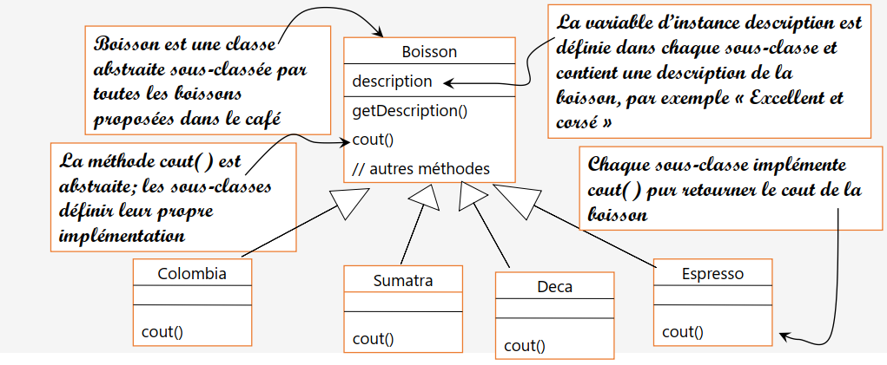
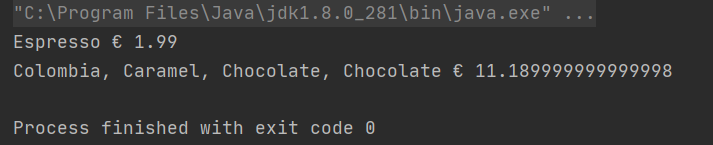
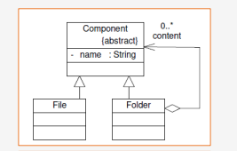
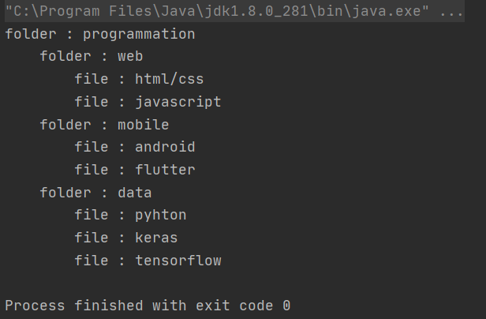

# Design Patterns

## Pattern Strategy
On considère la classe Employe (voir annexe) qui est définie par :
* deux variables d’instance cin et salaireBrutMensuel,
* deux constructeurs, les getters et setters
* et une méthode calculerIGR qui retourne l’impôt général sur les revenus salariaux.
* La méthode getSalaireNetMensuel retourne le salaire net mensuel.

Supposant que la formule de calcul de l’IGR diffère d’un pays à l’autre.
Au Maroc, par exemple le calcul s’effectue selon les cas suivant :
* Si le salaire annuel est inférieur à 40000, le taux de l’IGR est : 5%
* Si le salaire annuel est supérieur à 40000 et inférieur à 120000, le taux de l’IGR est : 20%
* Si le salaire annuel est supérieur à 120000 le taux de l’IGR est : 42%

En Algérie, le calcul s’effectue en utilisant un taux unique de 35%.

Comme cette classe est destinée à être utilisée dans différent type de pays inconnus au moment du développement de
cette classe
1. Identifier les méthodes qui vont subir des changements chez le client.
2. En appliquant le pattern strategie, essayer de rendre cette classe fermée à la modification et ouverte à l’extension.
3. Créer une application de test.
4. Proposer une solution pour choisir dynamiquement l’implémentation de calcul de l’IGR.

```java
package strategy_pattern;

public class Employe {
    private String cin;
    private float salaireBrutMensuel;
    private IEmployeStrategy employeStrategy;

    public Employe(String cin, float salaireBrutMensuel) {
        this.cin = cin;
        this.salaireBrutMensuel = salaireBrutMensuel;
    }

    public String getCin() {
        return cin;
    }

    public void setCin(String cin) {
        this.cin = cin;
    }

    public float getSalaireBrutMensuel() {
        return salaireBrutMensuel;
    }

    public void setSalaireBrutMensuel(float salaireBrutMensuel) {
        this.salaireBrutMensuel = salaireBrutMensuel;
    }

    public float calculerIGR() {
        float salaireBrutAnnuel = salaireBrutMensuel*12;
        float taux=42;
        return salaireBrutAnnuel*taux/100;
    }

    public float getSalaireNetMensuel() {
        float igr=calculerIGR();
        float salaireNetAnnuel=salaireBrutMensuel*12-igr;
        return salaireBrutMensuel/12;
    }

    public void setEmployeStrategy(IEmployeStrategy employeStrategy) {
        this.employeStrategy = employeStrategy;
    }
}

// Getters et Setters

``` 
## Diagramme de Classe pour le Design Pattern Strategy



## Impleméntation
``` java
package strategy_pattern;

public interface IEmployeStrategy {
    public float calculerIGR(float salaireBrutMensuel);
}

```


``` java
package strategy_pattern;

public class AlgeriaIGR implements IEmployeStrategy {
    private final float algeriaTaux= 35;
    @Override
    public float calculerIGR(float salaireBrutMensuel) {
        float salaireBrutAnnuel = salaireBrutMensuel*12;
        return salaireBrutAnnuel*algeriaTaux/100;
    }
}

```


``` java
package strategy_pattern;

public class MoroccoIGR implements IEmployeStrategy {
    private final float taux1 = 5;
    private  final float taux2 = 20;
    private final float taux3= 42;
    @Override
    public float calculerIGR(float salaireBrutMensuel) {
        float salaireBrutAnnuel = salaireBrutMensuel*12;
        if(salaireBrutAnnuel <= 40_000) return salaireBrutAnnuel*taux1/100;
        if(salaireBrutAnnuel > 40_000 && salaireBrutAnnuel <= 120_000) return salaireBrutAnnuel*taux2/100;
        if(salaireBrutAnnuel > 120_000) return salaireBrutAnnuel*taux3/100;
        return 0;
    }
}

```

## Test
```java 
package strategy_pattern;

import java.util.Scanner;

public class Main {
    public static void main(String[] args) {
        Employe employe = new Employe("1111",12_000);
        Scanner clavier = new Scanner(System.in);
        while(true) {
            System.out.println("Choisir une stratégie : ");
            String nomStrategy =clavier.next();
            if(nomStrategy.equals("quit")) break;
            try {
                Class c = Class.forName(nomStrategy);
                IEmployeStrategy strategy = (IEmployeStrategy) c.newInstance();
                employe.setEmployeStrategy(strategy);
                System.out.println(employe.calculerIGR());
            } catch (Exception e) {
                System.out.println(e);
            }
        }
    }
}

``` 

#### Résultat Desing Pattern Strategy



## Pattern Observer
Le pattern Observer définit une relation entre
les objets de type un à plusieurs, de façon que,
lorsqu’un objet change d’état, tous ce qui en
dépendent en soient informés et soient mis à
jour automatiquement

## Diagramme de Classe pour le Design Pattern Observer



## Impleméntation
``` java
package observer_pattern.observable;

import observer_pattern.observer.Observer;

public interface Observable {
    public void addObserver(Observer o);
    public void removeObsever(Observer o);
    public void notifyObservers();

}

```

``` java
package observer_pattern.observable;

import observer_pattern.observer.Observer;

import java.util.ArrayList;
import java.util.List;

public class ObservableImpl implements Observable {
    private List<Observer> observers=new ArrayList<>();
    private int etat;

    @Override
    public void addObserver(Observer o) {
        observers.add(o);
    }

    @Override
    public void removeObsever(Observer o) {

    }

    @Override
    public void notifyObservers() {
        for(Observer o:observers){ o.update(this); }
    }

    public int getEtat() {
        return etat;
    }

    public void setEtat(int etat) {
        this.etat = etat;
        this.notifyObservers();
    }
}

```

``` java
package observer_pattern.observer;

import observer_pattern.observable.Observable;

public interface Observer {
    public void update(Observable o);
}

```

``` java
package observer_pattern.observer;

import observer_pattern.observable.Observable;
import observer_pattern.observable.ObservableImpl;

public class ObserverImpl1 implements Observer{

    @Override
    public void update(Observable o) {
        int nouvelEtat=((ObservableImpl)o).getEtat();
        System.out.println("Observer 1 a reçu la nouvelle valeur de état:"+nouvelEtat);
    }
}

```

``` java
package observer_pattern.observer;

import observer_pattern.observable.Observable;
import observer_pattern.observable.ObservableImpl;

public class ObserverImpl2 implements Observer {
    @Override
    public void update(Observable o) {
        int nouvelEtat=((ObservableImpl)o).getEtat();
        System.out.println("Observer 2 Mise à jour avec état:"+nouvelEtat);
    }
}

```


## Test
```java 
package observer_pattern.observer;

import observer_pattern.observable.ObservableImpl;

public class Main {
    public static void main(String[] args) {
        // Création du sujet
        ObservableImpl observable=new ObservableImpl();
        // Création des observateurs
        ObserverImpl1 o1=new ObserverImpl1(); ObserverImpl2 o2=new ObserverImpl2();
        // Changer l'état du sujet
        System.out.println("---- Changement d'atat -----");
        observable.setEtat(70);
        // Enregistrer les observateur
        observable.addObserver(o1); observable.addObserver(o2);
        // Changer l'état du sujet
        System.out.println("---- Changement d'etat -----");
        observable.setEtat(90);
        // Supprimer un observateur
        observable.removeObsever(o1);
        //Changer l'état du sujet
        System.out.println("---- Changement d'etat -----");
        observable.setEtat(23);
    }
}


``` 

#### Résultat Desing Pattern Observer



## Pattern Decorator
Le pattern Décorateur attache dynamiquement des responsabilités supplémentaires à un
objet. Il fournit une alternative souple à la dérivation, pour étendre les fonctionnalités.

## Diagramme de Classe pour le Design Pattern Decorator





## Impleméntation
``` java
package decorator_pattern;

public abstract class Boisson {
    protected String description;
    public String getDescription() {
        return description;
    }
    public abstract double cout();
    }
```

``` java
package decorator_pattern;

public abstract class DecorateurIngredient extends Boisson {
    protected Boisson boisson;
    public DecorateurIngredient(Boisson boisson) {
        this.boisson = boisson;
    }
    public abstract String getDescription();
}

```

``` java
package decorator_pattern.boissons;

import decorator_pattern.Boisson;

public class Colombia extends Boisson {
    public Colombia(){
        description="Colombia";
    }
    public double cout() {
        return 7.89;
    }
}

```

``` java
package decorator_pattern.boissons;

import decorator_pattern.Boisson;

public class Espresso extends Boisson {
    public Espresso(){
        description="Espresso";
    }
    public double cout() {
        return 1.99;
    } }

```

``` java
package decorator_pattern.boissons;

import decorator_pattern.Boisson;

public class Sumatra extends Boisson {
    public Sumatra(){
        description="Sumatra";
    }
    public double cout() {
        return 8.99;
    }
}

```


## Test
```java 
package decorator_pattern;

import decorator_pattern.boissons.Colombia;
import decorator_pattern.boissons.Espresso;
import decorator_pattern.ingredients.Caramel;
import decorator_pattern.ingredients.Chocolate;

public class Main {
    public static void main(String[] args) {
        Boisson b1=new Espresso();
        System.out.println(b1.getDescription()+" € "+b1.cout());
        Boisson b2=new Colombia();
        b2=new Caramel(b2);
        b2=new Chocolate(b2);
        b2=new Chocolate(b2);
        System.out.println(b2.getDescription()+" € "+b2.cout());
    }
}

``` 

#### Résultat Desing Pattern Decorator



## Pattern Composite
Le Design Pattern Composite permet d'isoler l'appartenance à un agrégat , d'rganiser les objets en structure arborescente afin de représenter une hiérarchie.
et Permettre à la partie cliente de manipuler un objet unique et un objet composé de la même manière.

## Diagramme de Classe pour le Design Pattern Composite



## Impleméntation
``` java
package composite_pattern;

public abstract class Composant {
    protected String name;
    protected int level;
    public Composant(String name) {
        this.name = name;
    }

    public abstract void show();

    public String tab() {
        String tab = "";
        for (int i = 0; i < level; i++) {
            tab = tab + "\t";
        }
        return tab;
    }
}

```

``` java
package composite_pattern;

public class File extends Composant {
    public File(String name) {
        super(name);
    }

    @Override
    public void show() {
        System.out.println(tab() + "file : " + name);
    }

}

```

``` java
package composite_pattern;

import java.util.ArrayList;
import java.util.List;

public class Folder extends Composant {
    private final List<Composant> listComposents = new ArrayList<>();

    public Folder(String name) {
        super(name);
    }

    public Composant addComponent(Composant comp) {
        comp.level = this.level + 1;
        listComposents.add(comp);
        return comp;
    }

    @Override
    public void show() {
        System.out.println(tab() + "folder : " + name);
        for (Composant c : listComposents) {
            c.show();
        }
    }
}

```

## Test
```java 
package composite_pattern;

public class Main {
    public static void main(String[] args) {
        Folder root = new Folder("programmation");
        Folder d1 = (Folder) root.addComponent(new Folder("web"));
        Folder d2 = (Folder) root.addComponent(new Folder("mobile"));
        Folder d3 = (Folder) root.addComponent(new Folder("data"));
        d1.addComponent(new File("html/css"));
        d1.addComponent(new File("javascript"));

        d2.addComponent(new File("android"));

        d2.addComponent(new File("flutter"));
        d3.addComponent(new File("pyhton"));
        d3.addComponent(new File("keras"));
        d3.addComponent(new File("tensorflow"));


        root.show();
    }
}

``` 

#### Résultat Desing Pattern Composite


